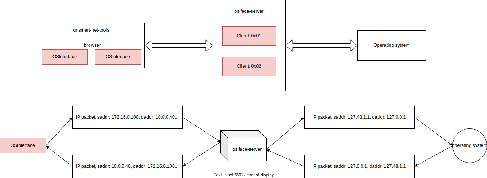

# unsmart-net-tools-osiface-server

## What

This is an extension [unsmart-net-tools](https://github.com/Snorkungen/unsmart-net-tools) project. unsmart-net-tools is a webapplication that aims to emulate the TCP/IP stack in the browser.

osiface-server would act as a gateway, allowing IP packets generated on the browser to communicate with the host local area network.

## How

The unsmart-net-tools application relies on an abstraction called interfaces to transport packets to another Interface object. So relying on that fact, an OSInterface object would take the packet information and give it to the osiface-server, which would the forward it out through the servers host operating system.

#### Client side

The client being the OSInterface object that operating in the browser. Would first establish a WebSocket connection with the osiface-server. And the register the OSInterface as a client to the server. The server will respond with a client-id and some configuration information, including what destinations (IP addresses), that the server is able to communicate with.

#### Server side

When registering a client the server, the server assigns a unique client id, that it expects to receive from future communication with the client. When the server receives a request to forward a packet the server, translates the IP addresses of the received packet, to a address pair that is native to the local network. Furthermore the server the forwards the packet, through the operating system, and the listens for a response/responses to the forwarded packet. If the server receives a response to a forwarded packet, then the server would forward the received packet to the registered client, using the established WebSocket connection.

